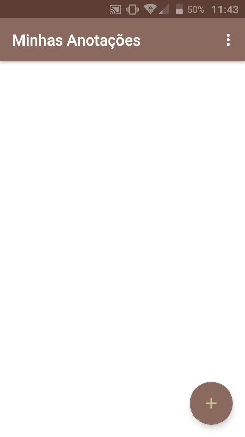
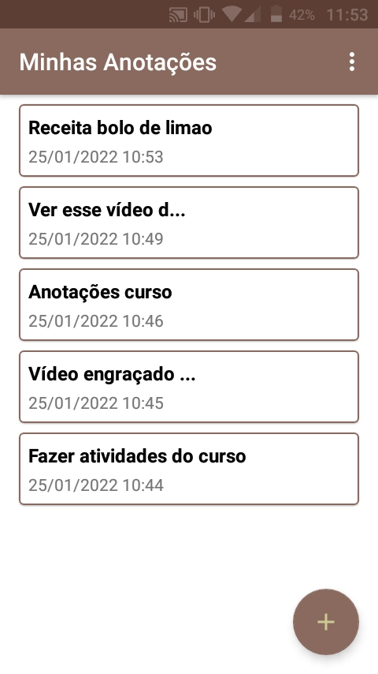
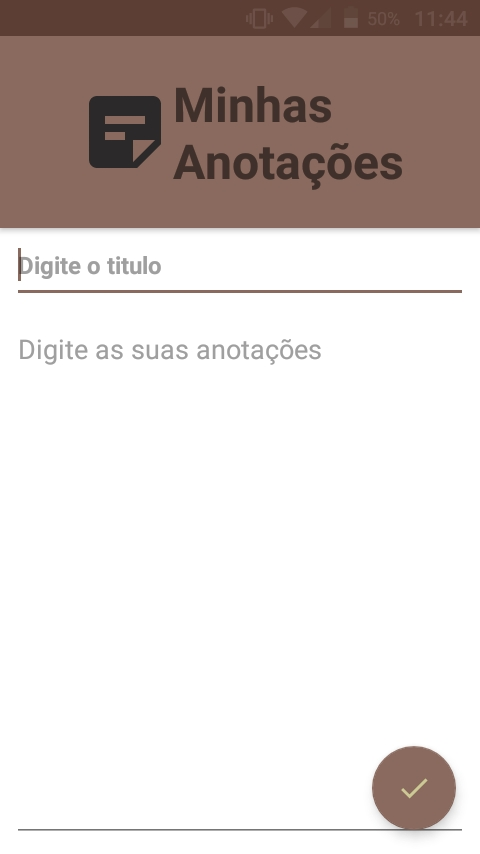
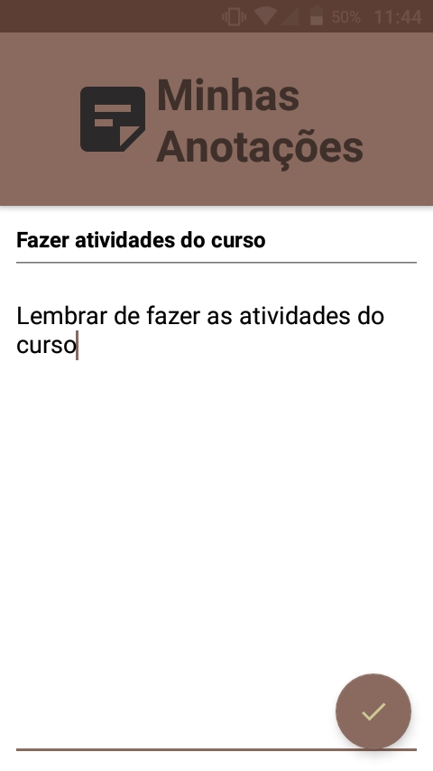
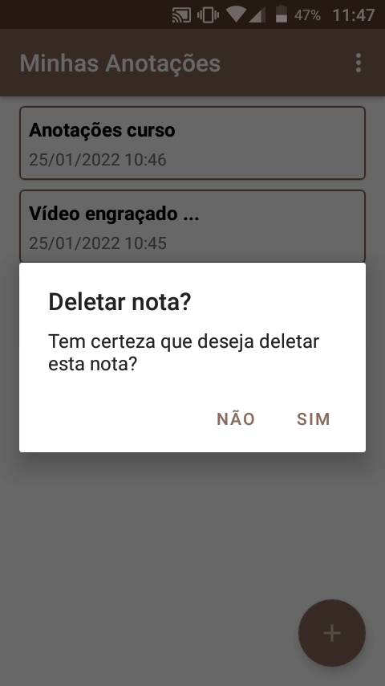

# Minhas anotações

Aplicativo para escrever e guardar anotações.

Utilizando da tecnologia SQLite para armazenamento interno no dispositivo, o aplicativo permite as operações cruciais de um banco de dados. É possivel Criar, Ler, Atualizar e Deletar as notas disponiveis.

### * Topicos estudados *

 - Uso do SQLite, permitindo a persistencia de dados  
 - Internacionalização, fazendo com que o APP tenha duas linguas disponiveis (Inglês e Português)  
 - Operações no banco de dados e na UI para mostrar alterçaões feitas para o usuario.  

### * Alguns funcionalidades que o aplicativo possui *

 - Quando se está criando ou editando uma nova nota, caso o botão de voltar seja apertado e alguma alteração tenha sido feita na nota, um alerta é exibido perguntando se é desejado descartar as alterações feitas ou cancelar  
 - Um botão na tela inicial permitindo que todas as notas sejam apagadas. Um alerta também é exibido para que o usuario confirme a ação  
 - É possivel apagar uma note especifica pressionando e segurando sobre ela por um tempo, um alerta também será mostrado para que o usuario confirme que deseja apagar a nota  

<h3> Telas do aplicativo em um celular Multilaser MS50L</h3>

 

 

 

 

 

